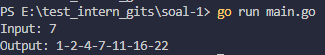
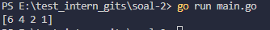
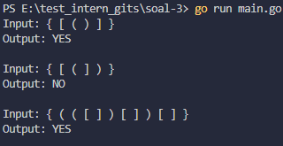

2. Berapa ukuran kompleksitas kodinganmu? Jelaskan detail kompleksitas jawaban No.3.

Kode ini tetap memiliki kompleksitas O(n), 
karena hanya melakukan satu kali loop dan operasi stack (push/pop) bersifat O(1), 
artinya jika inputan 10 karakter maka loop jalan 10 kali.

## OUPUT SOAL 1

## OUPUT SOAL 2

## OUPUT SOAL 3
